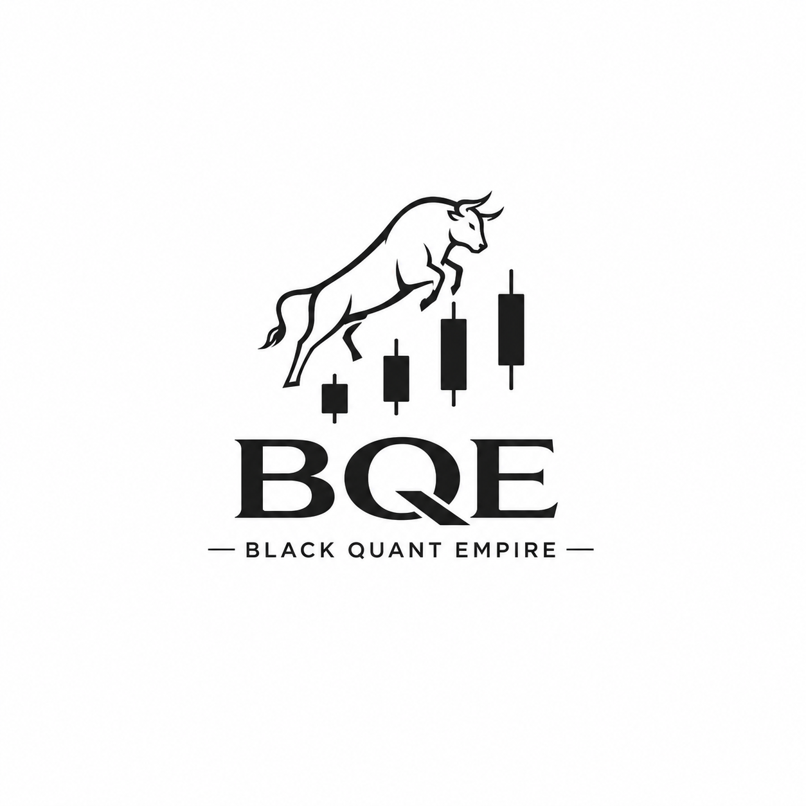

  
  
# Black Quant Empire (BQE)

> Quantitativer Handel auf Basis von Mathematik und Algorithmen

## Überblick

**Black Quant Empire** ist ein österreichisches Fintech-Unternehmen, das spezialisierte **quantitative Handelsalgorithmen** für Swing- und Day-Trading entwickelt. Unsere proprietären mathematischen Modelle analysieren Marktdaten in Echtzeit und generieren datengestützte Handelssignale für Gold-Futures, NASDAQ-Futures und Einzelaktien.

Wir kombinieren:
- **Statistische Analyse** und Mustererkennung
- **Machine Learning** und Advanced Analytics
- **Strenge Risikokontrolle** und Disziplin
- **Automatisierte Ausführung** für optimale Timing und Präzision

---

## 🎯 Kernmerkmale

### Algorithmen-Typen

**Swing Trading Modelle**
- Mittelfristige Preisbewegungen (Tage bis Wochen)
- Technische Indikatoren und Marktstruktur-Analyse
- Risikoangepasste Positionierung
- Automatisierte Ein- und Ausstiegssignale

**Day Trading Strategien**
- Kurzfristige Marktineffizienzen nutzen
- Intraday Preisaktionen und Volatilitätsmuster
- Hochfrequente Signalerzeugung
- Strenge Risikolimits und Positionskontrolle

### Unterstützte Anlageklassen

- **Gold-Futures (CFDs)** — Edelmetallhandel mit algorithmischer Präzision
- **NASDAQ-Futures (CFDs)** — Tech-Sektor-Engagement durch quantitative Modelle
- **Einzelne Aktien** — Erweiterung auf den Einzelaktienhandel

### Risikomanagement

Jede Position wird mit mehrschichtigen Sicherheitsmechanismen versehen:

- **Positionsgröße** — Volatilitätsbasierte Berechnung
- **Stop Losses** — Automatische Risikolimits für alle Trades
- **Portfolio-Überwachung** — Echtzeitanalyse des Gesamtrisikos
- **Drawdown-Kontrolle** — Maximale akzeptable Verluste
- **Modell-Validierung** — Kontinuierliches Backtesting

---

## ⚠️ Wichtiger Risiko-Disclaimer

**Der Handel mit Finanzderivaten birgt erhebliche finanzielle Risiken.**

- 📊 **Historische Leistung** ist **KEINE** Garantie für zukünftige Ergebnisse
- 💥 **Quantitative Modelle** können Black-Swan-Events nicht vorhersagen
- 📉 Marktbedingungen ändern sich; vergangene Modelle passen sich möglicherweise nicht an
- ⚡ **Technologieausfälle** oder **Ausführungsfehler** können auftreten
- 🎲 Sie können **Ihre gesamte Investition verlieren**

### Nicht geeignet für:
- Anfänger und unerfahrene Trader
- Personen, die ihre Investition nicht verlieren können
- Personen mit niedriger Risikotoleranz
- Personen ohne Handelserfahrung

**Konsultieren Sie immer einen qualifizierten Finanzberater, bevor Sie Handelsabschnitte treffen.**

---

## 🔧 Technische Architektur

### Stack

- **Datenverarbeitung:** Python, NumPy, Pandas
- **Machine Learning:** Scikit-learn, TensorFlow
- **Echtzeitanalyse:** WebSockets für Live-Marktdaten
- **Backtesting:** Proprietäres Backtesting-Framework
- **Ausführung:** APIs von zertifizierten Brokern (PCI-DSS konform)
- **Hosting:** AWS (EU-Region, DSGVO-konform)

### Sicherheit

- 🔒 **HTTPS/TLS 1.2+** für alle Datenübertragungen
- 🔐 **AES-256-Verschlüsselung** für sensitive Daten (Quellcode, Algorithmen)
- 🔑 **Zwei-Faktor-Authentifizierung (2FA)** verfügbar
- 🛡️ **Firewalls** und **Eindringlingserkennung**
- ✅ **Regelmäßige Sicherheitsprüfungen** und Penetrationstests

---

## 📋 Abonnement-Modell

**Monatlich wiederkehrend, automatische Verlängerung**

- Zugang zu allen Handelsalgorithmen
- Echtzeitige Handelssignale
- API-Zugang für Entwickler
- 24/7 Kundenunterstützung
- Detaillierte Performance-Reports

**Kündigung:** Jederzeit möglich mit 7 Tagen Kündigungsfrist vor dem nächsten Abrechnungszyklus

---

## 🌍 Regulatorische Compliance

**Österreich**
- Geltende österreichische Datenschutzgesetze (DSG 2018)
- ePrivacy-Richtlinie

**EU**
- **DSGVO** (Datenschutz-Grundverordnung) Konformität
- **ESMA** (European Securities and Markets Authority) Standards

**International**
- **US-Export-Kontrollvorschriften** (EAR, OFAC)
- **Sanktionsprüfung** für unterstützte Länder/Personen

---

## 📞 Kontakt

**Hauptbüro**
- Black Quant Empire GmbH
- Wien, Österreich

**E-Mail**
- **Info:** info@blackquantempire.at
- **Support:** support@blackquantempire.at
- **Business:** business@blackquantempire.at
- **Datenschutz:** dpo@blackquantempire.at
- **Sicherheit:** security@blackquantempire.at

**Online**
- 🌐 Website: [blackquantempire.at](https://schwarzrene.github.io)
- 💼 LinkedIn: [Black Quant Empire](https://linkedin.com)
- 📱 Twitter/X: [@BlackQuantEmpire](https://twitter.com)

---

## 📚 Dokumentation

- **[Datenschutzerklärung](./privacy.html)** — Datenerfassung und Datenschutz
- **[Softwarelizenzvereinbarung](./license.html)** — Nutzungsbedingungen
- **[Barrierefreiheitserklärung](./accessibility.html)** — WCAG 2.1 AA Compliance
- **[Handelsstrategie](./strategy.html)** — Detaillierte Algorithmen-Beschreibung

---

## 🤝 Beiträge

Black Quant Empire ist ein proprietäres Fintech-Unternehmen. Wir akzeptieren derzeit keine öffentlichen Code-Beiträge. Weitere Informationen zu Careers und Partnerschaften finden Sie unter:

👉 **[careers.blackquantempire.at](https://schwarzrene.github.io/careers.html)**

---

## 📄 Lizenz

Black Quant Empire ist **proprietäre Software**. Der Zugriff erfolgt über ein bezahltes Abonnement-Modell.

**© 2026 Black Quant Empire GmbH. Alle Rechte vorbehalten.**

---

## ⚖️ Haftungsausschluss

Diese Software wird "wie besehen" ohne jegliche Gewährleistung bereitgestellt. Black Quant Empire GmbH haftet nicht für:

- Handelsverluste oder finanzielle Schäden
- Datenverluste oder Systemausfälle
- Indirekten, zufälligen oder Folgeschaden
- Gewinnansprüche oder spezifische Ergebnisse

**Der Handel mit Derivaten ist hochriskant. Investieren Sie nur Kapital, das Sie sich leisten können zu verlieren.**

---

## 🔒 Sicherheitshinweise

Falls Sie ein **Sicherheitsproblem** entdecken:

1. **NICHT** öffentlich posten
2. E-Mail an: **security@blackquantempire.at**
3. Bitte detaillieren Sie das Problem und wie es zu reproduzieren ist
4. Wir werden Ihre Meldung innerhalb von 48 Stunden bestätigen

---

## 🎓 Bildungsressourcen

Neue Nutzer sollten diese Ressourcen studieren:

- ✅ **Risikowarnung** — Risiken des Hebelhandels verstehen
- ✅ **DSGVO-Rechte** — Ihre Datenschutzrechte kennen
- ✅ **API-Dokumentation** — Für Entwickler und fortgeschrittene Benutzer
- ✅ **Backtesting-Anleitung** — So optimieren Sie Ihre Strategien

---

## 📈 Performance & Statistiken

**Wichtig:** Bisherige Leistung garantiert KEINE zukünftigen Ergebnisse.

Für vollständige Performance-Berichte, Kennzahlen und historische Daten bitte:

👉 **Im Dashboard einloggen** oder **support@blackquantempire.at kontaktieren**

---

## 🎉 Danksagungen

Entwickelt mit modernsten Technologien und rigoroser mathematischer Analyse durch das Black Quant Empire Team in Wien, Österreich.

---

**Zuletzt aktualisiert:** 17. Mai 2026  
**Version:** 1.0.0

---

*Black Quant Empire — Wo Mathematik und Märkte treffen.*
